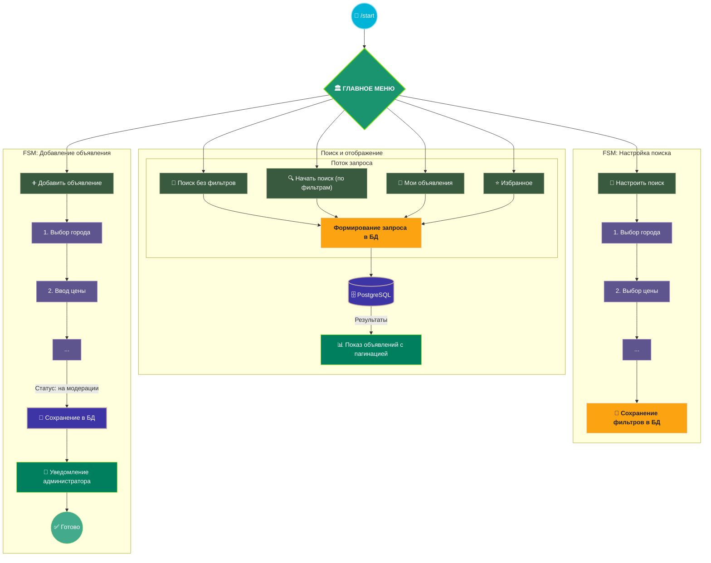
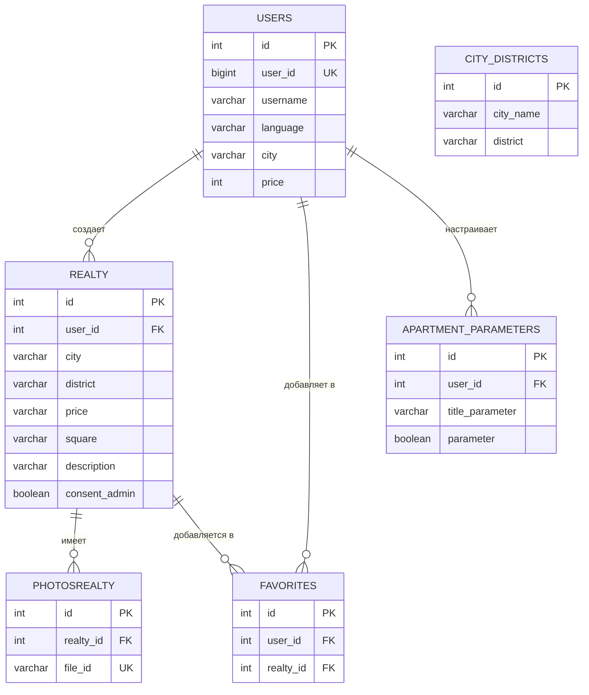
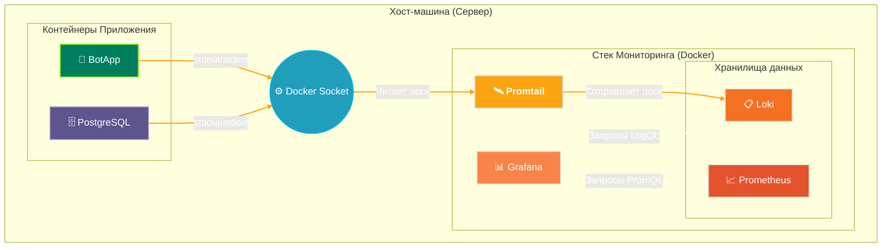

# 🚀 RealEstateBot: Telegram-бот для поиска и публикации объявлений о недвижимости

 
 
 
 


**RealEstateBot** — это многофункциональный Telegram-бот, разработанный для упрощения процессов поиска, продажи и аренды недвижимости в Турции. Он предоставляет интуитивно понятный интерфейс для пользователей и мощные инструменты администрирования для управления контентом. Проект состоит из двух основных частей: самого бота (`BotApp`) и стека для мониторинга его работы (`MonitoringStack`).

---

## 📄 Содержание

1.  [Архитектура проекта](#-архитектура-проекта)
2.  [Функционал](#-функционал)
    *   [Для пользователей](#-для-пользователей)
    *   [Для администраторов](#-для-администраторов)
3.  [Технологический стек](#-технологический-стек)
4.  [Приложение бота (`BotApp`)](#-приложение-бота-botapp)
    *   [Логика работы (User Flow)](#-логика-работы-user-flow)
    *   [Установка и запуск](#-установка-и-запуск)
    *   [CI/CD и деплой](#-cicd-и-деплой)
    *   [Структура базы данных](#-структура-базы-данных)
    *   [Обзор обработчиков (Handlers)](#-обзор-обработчиков-handlers)
5.  [Стек мониторинга (`MonitoringStack`)](#-стек-мониторинга-monitoringstack)
    *   [Архитектура мониторинга](#-архитектура-мониторинга)
    *   [Развертывание и CI/CD](#-развертывание-и-cicd)

---

## 🏛️ Архитектура проекта

Проект состоит из двух Docker Compose-приложений, разворачиваемых на одном сервере. `BotApp` обрабатывает всю логику взаимодействия с пользователем, в то время как `MonitoringStack` собирает метрики и логи для обеспечения стабильности и производительности.

```mermaid
graph LR
    %% === 1. Определения стилей для тёмной темы ===
    classDef userStyle fill:#00b4d8,stroke:#90e0ef,stroke-width:2px,color:#fff
    classDef appStyle fill:#007f5f,stroke:#70e000,stroke-width:1px,color:#fff
    classDef dbStyle fill:#5e548e,stroke:#9f86c0,stroke-width:2px,color:#fff
    classDef grafanaStyle fill:#f9844a,stroke:#e0e0e0,stroke-width:1px,color:#fff
    classDef prometheusStyle fill:#e6522c,stroke:#e0e0e0,stroke-width:1px,color:#fff
    classDef lokiStyle fill:#f37121,stroke:#e0e0e0,stroke-width:1px,color:#fff
    classDef agentStyle fill:#fca311,stroke:#e0e0e0,stroke-width:1px,color:#fff
    classDef hidden fill:transparent,stroke:transparent,color:transparent

    %% === 2. Структура блоков (subgraphs) ===
    subgraph "Клиент"
        U["📱 Пользователь Telegram"]
    end

    subgraph "Инфраструктура на Сервере"
        direction TB

        subgraph "Приложение | BotApp"
            direction LR
            BA["🤖 Bot: Python/aiogram"]
            DB[("🗄️ База данных: PostgreSQL")]
        end

        subgraph "Мониторинг | MonitoringStack"
            subgraph "Сборщики (Агенты)"
                direction TB
                PA["🛰️ Promtail"]
            end
            
            subgraph "Хранилища"
                L["📋 Loki"]
                P["📈 Prometheus"]
                L ~~~ P
            end
            
            G["📊 Grafana"]
        end
    end

    %% === 3. Потоки данных и связи ===
    U -- "TCP/HTTPS - Telegram Bot API" --> BA
    BA <-->|ORM Peewee| DB

    %% Поток логов
    BA -.->|Логи| PA
    DB -.->|Логи| PA
    PA --> L

    %% Поток метрик

    
    %% Поток визуализации
    G -- "Запросы PromQL" --> P
    G -- "Запросы LogQL" --> L

    %% === 4. Применение стилей к узлам ===
    class U userStyle
    class BA appStyle
    class DB dbStyle
    class G grafanaStyle
    class P prometheusStyle
    class L lokiStyle
    class PA agentStyle

    %% === 5. Стилизация связей ===
    linkStyle 0 stroke:#00b4d8,stroke-width:2px,color:#fff
    linkStyle 1 stroke:#a999c7,stroke-width:2px,stroke-dasharray:5 5,color:#fff
    linkStyle 2,3 stroke:#f37121,stroke-width:2px,stroke-dasharray:3 3,color:#fff
    linkStyle 4,5 stroke:#f37121,stroke-width:2px,color:#fff
    linkStyle 6,7 stroke:#ccc,stroke-width:2px,stroke-dasharray:3 3,color:#fff
```



---

## ✨ Функционал

### 👤 Для пользователей:
*   **Мультиязычность**: Поддержка русского, английского и турецкого языков.
*   **Гибкий поиск недвижимости**:
    *   Быстрый поиск всех доступных объявлений без фильтров.
    *   Детальная настройка фильтров: тип сделки (аренда/покупка), город, тип недвижимости (жилая, коммерческая, земля), параметры объекта (количество комнат, тип дома), цена, площадь, район.
*   **Публикация объявлений**: Пошаговый процесс добавления собственного объявления с фотографиями, которое отправляется на модерацию администратору.
*   **"Избранное"**: Возможность сохранять понравившиеся объявления для быстрого доступа.
*   **Управление объявлениями**: Пользователи могут просматривать и удалять свои активные объявления.
*   **Взаимодействие с объявлениями**:
    *   Просмотр детальной информации и фотографий с пагинацией.
    *   Получение контактов продавца.
    *   Возможность поделиться объявлением с другом через Telegram.

### 👑 Для администраторов:
*   **Админ-панель**: Доступ к панели через команду `/admin`.
*   **Модерация объявлений**:
    *   Просмотр объявлений, ожидающих модерации, в специальном чате.
    *   Возможность одобрить (опубликовать) или отклонить объявление нажатием одной кнопки.
    *   Автоматическое уведомление пользователя о решении модератора.
*   **Управление всеми объявлениями**: Просмотр полного списка объявлений (активных, скрытых, на модерации) с удобной пагинацией.
*   **Массовая рассылка**: Инструмент для отправки сообщений (включая фото, видео, текст) всем пользователям бота.
*   **Статистика**: Просмотр основной статистики (общее количество пользователей, количество объявлений по статусам).

---

## 🛠️ Технологический стек

| Компонент | Технология | Описание |
| :--- | :--- | :--- |
| **Бот (`BotApp`)** | **Python 3.13** | Основной язык программирования. |
| | **aiogram 3** | Асинхронный фреймворк для создания Telegram-ботов. |
| | **Peewee** | Простой и легковесный ORM для взаимодействия с базой данных. |
| | **PostgreSQL** | Надежная реляционная база данных для хранения информации. |
| | **Pydantic** | Валидация данных и управление настройками через переменные окружения. |
| | **Docker** | Контейнеризация приложения и базы данных для легкого развертывания. |
| **Мониторинг (`MonitoringStack`)** | **Prometheus** | Сбор и хранение метрик производительности. |
| | **Loki** | Система для сбора и агрегации логов. |
| | **Grafana** | Визуализация метрик и логов в виде дашбордов. |
| | **Promtail, cAdvisor, Node Exporter** | Агенты для сбора логов и метрик с Docker и хост-машины. |
| **CI/CD** | **GitHub Actions** | Автоматизация развертывания обоих компонентов при push в `main`. |

---

## 🤖 Приложение бота (`BotApp`)

### 📈 Логика работы (User Flow)

Основные сценарии взаимодействия с ботом реализованы через машины состояний (FSM).



### 🔧 Установка и запуск

1.  **Клонировать репозиторий:**
    ```bash
    git clone https://github.com/your-username/RealEstateBot.git
    cd RealEstateBot/BotApp
    ```

2.  **Настроить переменные окружения:**
    Создайте файл `.env` в корне `BotApp` и заполните его по аналогии с примером ниже:
    ```env
    # Токен вашего Telegram-бота
    BOT_TOKEN=12345:ABC-DEF12345

    # Пароль для пользователя postgres в БД
    DB_PASSWORD=your_strong_password
    ```

3.  **Запуск через Docker Compose:**
    Перейдите в директорию `docker/` и выполните команду:
    ```bash
    docker compose up -d --build
    ```
    Эта команда соберет Docker-образ, запустит контейнеры с ботом и базой данных PostgreSQL.

### 🔄 CI/CD и деплой

В проекте настроен workflow для GitHub Actions (`.github/workflows/deploy.yml`), который автоматизирует процесс развертывания на сервере.

**Для работы CI/CD необходимо:**
1.  **Настроить Self-Hosted Runner** на вашем сервере, чтобы GitHub мог выполнять на нем команды.
2.  **Добавить Secrets в настройках репозитория GitHub:**
    *   `BOT_TOKEN`: Токен Telegram-бота.
    *   `DB_PASSWORD`: Пароль для базы данных.

При каждом `push` в ветку `main` GitHub Actions автоматически подключится к вашему серверу, скачает последнюю версию кода, пересоберет Docker-образ и перезапустит контейнеры с ботом и БД.

### 🗄️ Структура базы данных

Схема базы данных, реализованная с помощью ORM Peewee.



### 📂 Обзор обработчиков (Handlers)

Вся логика взаимодействия с пользователем разделена на модули в директории `bot/handlers/`.

#### `main/` - Основное взаимодействие
*   `callbacks.py`: Обрабатывает нажатия на кнопки главного меню: смена языка, переход в "Мои объявления" и "Избранное", возврат в главное меню.
*   `messages.py`: Реагирует на текстовую команду "🗂 Главное меню" из reply-клавиатуры.

#### `commands/` - Обработка команд
*   `main.py`: Обрабатывает команды:
    *   `/start`: Начало работы с ботом, регистрация пользователя, отображение главного меню. Поддерживает deep linking (`/start <ad_id>`) для показа конкретного объявления.
    *   `/admin`: Доступ к панели администратора (только для авторизованных пользователей).
    *   `/add_cities`: Админ-команда для массового добавления городов и районов в базу данных.
    *   `/rm_me`: Команда для пользователя, чтобы удалить свои данные из БД.
    *   `/id`: Служебная команда для получения ID чата.
    *   Также содержит хендлер для получения `file_id` любого медиафайла, отправленного в чат с ботом (только для админов).

#### `add_ads/` - Добавление нового объявления
Этот модуль реализует машину состояний (FSM) для пошагового создания объявления.
*   `callbacks.py`: Запускает FSM, обрабатывает выбор города и типа сделки (аренда/продажа).
*   `states.py`: Основная логика FSM. Последовательно проводит пользователя через все шаги: выбор типа недвижимости, количества комнат, ввод цены, площади, этажа, описания, загрузка фотографий (`file_id` сохраняются в БД) и ввод контактных данных. В конце формирует объявление, сохраняет его в БД со статусом "на модерации" и отправляет уведомление в админ-чат.

#### `search_setting/` - Настройка фильтров поиска
Модуль с FSM для детальной настройки параметров поиска.
*   `callbacks.py`: Обрабатывает все шаги настройки:
    *   Выбор типа сделки (аренда/покупка).
    *   Выбор города.
    *   Выбор параметров (количество комнат, наличие мебели и т.д.).
    *   Выбор ценового диапазона и площади.
    *   Выбор районов (с пагинацией для городов с большим количеством районов).
    *   В конце отображает сводку выбранных фильтров и предлагает начать поиск. Все настройки сохраняются в БД для конкретного пользователя.

#### `start_search/` - Процесс поиска и просмотра
*   `callbacks.py`: Запускает процесс поиска на основе сохраненных фильтров пользователя или без них.
    *   Реализует **эффективную пагинацию**: для отображения результатов используется `LIMIT` и `OFFSET` в SQL-запросах, что позволяет не загружать все объявления сразу.
    *   Объявления отображаются "пачками" по 5 штук. Кнопка "Показать ещё 5 ✨" подгружает следующую порцию.
    *   Обрабатывает детальный просмотр объявления, переключение фотографий, получение контактов и добавление в избранное.

#### `favorites/` - Раздел "Избранное"
*   `callbacks.py`: Отображает список объявлений, добавленных пользователем в избранное, с пагинацией. Позволяет перейти к детальному просмотру любого избранного объявления.

#### `admin_panel/` - Функционал для администраторов
*   `callbacks.py`: Обрабатывает действия в админ-панели:
    *   **Модерация:** Обрабатывает нажатия кнопок "Опубликовать" и "Отклонить" в админ-чате. Изменяет статус объявления в БД и отправляет уведомление пользователю.
    *   **Управление объявлениями:** Реализует просмотр списка всех объявлений с пагинацией и возможностью скрыть/опубликовать любое из них.
*   `states.py`: Содержит FSM для процесса **массовой рассылки**. Администратор отправляет боту пост, и бот начинает рассылать его копию всем пользователям с определенным интервалом, чтобы избежать блокировки со стороны Telegram.

---

## 🖥️ Стек мониторинга (`MonitoringStack`)

Этот компонент предназначен для полного контроля над состоянием сервера и приложения `BotApp`.

### 🏗️ Архитектура мониторинга



### ⚙️ Ключевые компоненты

| Сервис | Назначение |
|:---|:---|
| **Grafana** | **Панель визуализации.** Отображает метрики и логи в виде графиков и дашбордов. |
| **Prometheus** | **База данных для метрик.** Собирает и хранит числовые метрики от различных источников (сервер, контейнеры). |
| **Loki** | **Система для агрегации логов.** Индексирует метаданные логов, обеспечивая быстрый поиск и фильтрацию. |
| **Promtail** | **Агент для сбора логов.** Автоматически обнаруживает Docker-контейнеры и отправляет их логи в Loki. |
| **cAdvisor** | **Анализатор производительности контейнеров.** Собирает детальные метрики по каждому контейнеру. |
| **Node Exporter** | **Экспортер метрик хост-машины.** Собирает метрики самого сервера (CPU, память, диски и т.д.). |

### 🚀 Развертывание и CI/CD

Процесс развертывания стека мониторинга аналогичен `BotApp`:
1.  **Настроить Self-Hosted Runner** на сервере.
2.  **Добавить GitHub Secrets** для учетных данных администратора Grafana:
    *   `GRAFANA_ADMIN_USER`
    *   `GRAFANA_ADMIN_PASSWORD`
3.  При `push` в `main` в директории `MonitoringStack` сработает соответствующий GitHub Actions workflow, который развернет или обновит стек на сервере.

После запуска веб-интерфейс Grafana будет доступен по адресу `http://<your_server_ip>:3000`.****